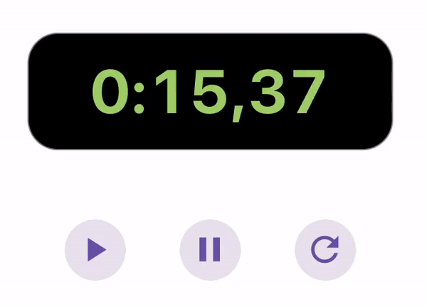

# Animated Stopwatch

[](https://www.npmjs.com/package/react-native-animated-stopwatch)
[](https://bundlephobia.com/result?p=react-native-animated-stopwatch)

[](https://github.com/rgommezz/react-native-animated-stopwatch/blob/master/LICENSE)

React Native Stopwatch component that empowers **reanimated worklets** to smoothly animate the digits change. Cross-platform, performant, with all **layout animations executed on the UI thread at 60FPS**. Compatible with Expo.



## Installation

```sh
npm install react-native-animated-stopwatch
```

You also need to install `react-native-reanimated` `2.5.x` or higher.

```sh
npm install react-native-reanimated
```

If you are installing reanimated on a bare React Native app, you should also follow this [additional installation instructions.](https://docs.swmansion.com/react-native-reanimated/docs/fundamentals/installation/)

## Usage

```tsx
import { useRef } from 'react';
import AnimatedStopwatch, {
  StopWatchMethods,
} from 'react-native-animated-stopwatch';

const stopwatchRef = useRef<StopWatchMethods>(null);

// Methods to control the stopwatch

function play() {
  stopwatchRef.current?.play();
}

function pause() {
  const elapsedTimeInMs = stopwatchRef.current?.pause();
  // Do something with the elapsed time
  console.log(elapsedTimeInMs);
}

function reset() {
  stopwatchRef.current?.reset();
}

return <AnimatedStopwatch ref={stopwatchRef} />;
```

## Props

| Name                 | Required | Type                               | Description                                                                                                                                                                                                                                                                                                                   |
| -------------------- | -------- | ---------------------------------- |-------------------------------------------------------------------------------------------------------------------------------------------------------------------------------------------------------------------------------------------------------------------------------------------------------------------------------|
| `animationDuration`  | no       | `number`                           | The enter/exit animation duration in milliseconds of a stopwatch digit. Defaults to `80`                                                                                                                                                                                                                                      |
| `animationDelay`     | no       | `number`                           | The enter/exit animation delay in milliseconds of a stopwatch digit. Defaults to `0`                                                                                                                                                                                                                                          |
| `animationDistance`  | no       | `number`                           | The enter/exit animation vertical distance in dp of a stopwatch digit. Defaults to `120`                                                                                                                                                                                                                                      |
| `containerStyle`     | no       | `StyleProp<ViewStyle>`             | The style of the stopwatch `View` container                                                                                                                                                                                                                                                                                   |
| `digitStyle`         | no       | `StyleProp<TextStyle>`             | Extra style applied to each digit, excluding separators (`:` and `,`). This is useful if the `fontFamily` has different widths per digit, to avoid an unpleasant fluctuation of the total stopwatch width as it runs. Check the example app where this is used on iOS's default San Francisco font, that presents this issue. |
| `leadingZeros`       | no       | `1` or `2`                         | The number of zeros for the minutes. Defaults to 1                                                                                                                                                                                                                                                                            |
| `enterAnimationType` | no       | `'slide-in-up' or 'slide-in-down'` | Whether the new digit should enter from the top or the bottom                                                                                                                                                                                                                                                                 |
| `separatorStyle`     | no       | `StyleProp<TextStyle>`             | Extra style applied only to separators. In this case, the colon (`:`) and the comma (`,`)                                                                                                                                                                                                                                     |
| `textCharStyle`      | no       | `StyleProp<TextStyle>`             | The style applied to each individual character of the stopwatch                                                                                                                                                                                                                                                               |
| `trailingZeros`      | no       | `0`, `1` or `2`                    | If `0`, the stopwatch will only display seconds and minutes. If `1`, the stopwatch will display seconds, minutes and hundredth of ms. If `2`, the stopwatch will display seconds, minutes and tens of ms. Defaults to `1`                                                                                                     |

## Methods

#### `play: () => void`

Starts the stopwatch or resumes it if paused. It has no effect if the stopwatch is already running.

```js
stopwatchRef.current?.play();
```

#### `pause: () => number`

Pauses the stopwatch. It has no effect if the stopwatch is either paused or reset. The method returns a snapshot of the time elapsed in ms.

```js
stopwatchRef.current?.pause();
```

#### `reset: () => void`

Resets the stopwatch to 0.

```js
stopwatchRef.current?.reset();
```

#### `getSnapshot: () => number`

Returns the current time elapsed in ms.

```js
stopwatchRef.current?.getSnapshot();
```

`stopwatchRef` refers to the [`ref`](https://reactjs.org/docs/hooks-reference.html#useref) passed to the `AnimatedStopwatch` component.

## Contributing

See the [contributing guide](CONTRIBUTING.md) to learn how to contribute to the repository and the development workflow.

## License

MIT

---

Made with [create-react-native-library](https://github.com/callstack/react-native-builder-bob)
